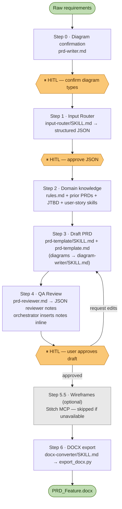

# Automated PRD Writing Pipeline Guide

This document explains how to use the PRD Writer workflow and how the end-to-end process operates. It is intended to help new contributors understand the system and interact with it in a consistent way.

---

## 0. Prerequisites

Before running the pipeline, ensure your environment meets the following requirements. Missing any of these will cause a silent failure at Step 6 (DOCX export).

**Pandoc** (required for DOCX export)

Install via your OS package manager:

```bash
# macOS
brew install pandoc

# Ubuntu / Debian
sudo apt-get install pandoc

# Windows
winget install JohnMacFarlane.Pandoc
```

Verify: `pandoc --version`

**pypandoc-binary** (Python binding — includes Pandoc binary, no separate install needed if you use this)

```bash
pip install pypandoc-binary
```

`pypandoc-binary` bundles its own Pandoc binary, so you can use this instead of the OS-level install above. Do not install both — they may conflict.

**Python 3.9+**

```bash
python --version
```

**File system write access**

The pipeline writes to `/domain-knowledge/[Domain_Name]/`. Make sure your agent IDE has write access to the project root.

---

## 1. Process Overview

The PRD workflow is orchestrated by the **Master PRD Writer** in [`prd-writer.md`](./prd-writer.md). It transforms raw product requirements into a complete PRD, routes the draft through review and approval, and can export the final result to DOCX.

**BPMN warning:** BPMN output is token-heavy and usually produces only a basic result because coordinates must be estimated manually.

The process has six main steps, with human approval gates at the key decision points.



### Step 0: Diagram Requirement Confirmation

- The system checks whether the feature needs any diagrams: BPMN, Activity Diagram, or Sequence Diagram.
- If the user has not specified diagram needs, the system must pause and ask before planning the rest of the workflow.

### Step 1: Data Pre-processing (Input Router)

- The raw request is passed through the `input-router` skill and normalized into a structured JSON object.
- The JSON includes feature scope, domain name, story candidates, user flow, business logic, requirements, success metrics, and missing information.
- If the domain folder does not exist yet, the system creates it before persisting the JSON file.
- The draft JSON is stored under `/domain-knowledge/[Domain_Name]/inputs/`.
- The user must review and approve this JSON before drafting begins.

### Step 2: Domain Knowledge Preparation

- The system reads `/domain-knowledge/[Domain_Name]/rules.md` and any existing PRDs or prior inputs in the same domain.
- The system also applies standards from:
  - `/knowledge-base/knowledge/jobs-to-be-done/SKILL.md`
  - `/knowledge-base/knowledge/user-story-skill/SKILL.md`

### Step 3: Drafting

- The approved JSON from Step 1 is rendered into a full PRD using the standard PRD template.
- The draft is stored under `/domain-knowledge/[Domain_Name]/PRDs/[Feature_Name]_PRD.md`.
- Diagrams are generated by `diagram-writer/SKILL.md` only. No other file contains diagram generation rules.

### Step 4: Quality Assurance (PRD Reviewer)

- The draft is reviewed by the `prd-reviewer`.
- The reviewer returns a structured JSON array of reviewer notes — each note has a `section`, `risk`, `fix_a`, and `fix_b`.
- The orchestrator inserts each note inline, directly below the affected section, using the `> [!WARNING] REVIEWER'S NOTE` callout format.
- The reviewer validates business logic, edge cases, JTBD alignment, and `Done when` acceptance criteria coverage.

### Step 5: User Approval (Critical Pause)

- The system must pause here for user review.
- The user can request edits, add information, or approve the PRD.
- The process stays in this step until the user explicitly approves the draft.

### Step 5.5: Optional Wireframe/UI Creation (Stitch MCP)

- After the PRD is approved, the system may generate wireframes based on the `UI/UX Specifications` section.
- This step should run only if the Stitch MCP tools are available.
- If Stitch is unavailable, the workflow should continue to export without blocking.

### Step 6: File Export (DOCX)

- After approval, the final Markdown PRD is exported to `.docx` using `export_docx.py` with `pypandoc`.
- The output file must be stored inside `/domain-knowledge/[Domain_Name]/PRDs/`.
- If a hosted export wrapper is unavailable, the workflow calls the local export script directly instead of failing the pipeline.

---

## 2. Recommended Input Structure

The quality of the Step 1 input strongly affects the quality of the generated PRD. To reduce follow-up questions and avoid `[NEEDS_CLARIFICATION]` placeholders, users should provide at least the following:

1. **Feature name and objective:** What is the feature, and what business or user value should it create?
2. **Problem context:** What is broken or missing today?
3. **Target user or actor:** Who is the main person or system using this feature?
4. **Basic user flow:** What does the happy path look like from start to finish?
5. **Business rules and edge cases:** What should happen in error, timeout, invalid input, or exception scenarios?
6. **Requirements or constraints:** Functional, non-functional, API, security, or operational constraints.
7. **Success metrics:** How will the team know the feature worked?
8. **Diagram needs:** State whether you want BPMN, Activity Diagram, Sequence Diagram, or no diagrams.

**Example of a strong input**

> "Create a Group Lucky Money feature for Lunar New Year. Objective: increase user engagement and seasonal transaction volume. Target users: existing wallet users in group chat. User flow: open feature from home screen, enter greeting, enter total amount of 200k, choose random split for 10 recipients, send, and share the claim link into the group chat. Edge cases: if an 11th user clicks, show 'All envelopes have been claimed'; if the sender has insufficient balance, block sending and show a deposit prompt. Generate a Sequence Diagram."

The clearer the input, the more accurate and complete the PRD will be.

---

## 3. When Not to Use the Full PRD Flow

The full six-step workflow is best for medium to large features, epics, or cross-functional product initiatives.

If the user only needs a lightweight artifact, it is usually faster to skip the full PRD flow and call a focused skill directly. Examples:

- A handful of Jira-ready user stories
- A JTBD analysis only
- A narrow requirements note without full PRD depth

In those cases, use:

- `/knowledge-base/knowledge/jobs-to-be-done/SKILL.md` for JTBD work
- `/knowledge-base/knowledge/user-story-skill/SKILL.md` for INVEST-standard user stories

This keeps the workflow lean and uses effort only where it adds real value.
