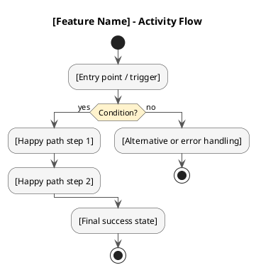
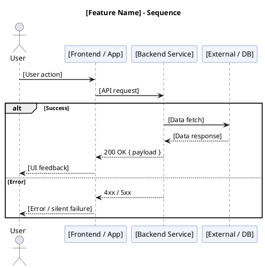

# Diagram Writer Skill

Draw one diagram at a time based on user selection. If the feature context is already known
(for example from a PRD session), skip context questions and go straight to drawing.

---

## Workflow

### Step 1 - Select diagram type (if not already specified)

Ask the user to choose one:

- **BPMN** - who does what across actors and systems
- **Activity Diagram** - branching logic with happy and error paths
- **Sequence Diagram** - message exchange between system components

Present the choice briefly.

### Step 2 - Gather context (if not already known)

Ask only what is still missing:

- What feature or process should the diagram cover?
- Who are the actors or system components involved?
- What is the happy path? Are there any key decisions or error cases?

### Step 3 - Draw

Generate the diagram using the rules below. Output the code block immediately with no preamble.
After output, offer to draw the other diagram types for the same feature.

---

## BPMN - bpmn.io XML

Output a ` ```xml ` fenced block containing valid BPMN 2.0 XML.

**Required structure:**
`<collaboration>` pool -> `<process>` with `<laneSet>` -> one `<lane>` per actor ->
all flow elements with `<flowNodeRef>` -> `<sequenceFlow>` for every connection ->
`<bpmndi:BPMNDiagram>` with `<dc:Bounds>` per shape and `<di:waypoint>` per edge.

**Lanes:** minimum User + App/Frontend + Backend Service. Add more if needed.

**Standard sizes:**

- `task`: 120x80 px
- `startEvent` / `endEvent`: 36x36 px
- `exclusiveGateway`: 50x50 px
- Pool label column: 30 px (lanes start at pool.x + 30, lane.width = pool.width - 30)
- Lane heights: User 120-130 px, App 200-220 px, each backend lane >= 100 px

**Layout rules:**

- Align tasks that communicate across lanes vertically to keep edges clean.
- Use `&amp;` for `&` in XML `name` attributes.

**Skeleton:**

```xml
<?xml version="1.0" encoding="UTF-8"?>
<definitions xmlns="http://www.omg.org/spec/BPMN/20100524/MODEL"
             xmlns:bpmndi="http://www.omg.org/spec/BPMN/20100524/DI"
             xmlns:dc="http://www.omg.org/spec/DD/20100524/DC"
             xmlns:di="http://www.omg.org/spec/DD/20100524/DI"
             id="Definitions_1" targetNamespace="http://bpmn.io/schema/bpmn">
  <collaboration id="Collaboration_1">
    <participant id="Pool_1" name="[Feature] Process" processRef="Process_1" />
  </collaboration>
  <process id="Process_1" isExecutable="false">
    <laneSet id="LaneSet_1">
      <lane id="Lane_User" name="User">
        <flowNodeRef>StartEvent_1</flowNodeRef>
        <!-- add flowNodeRefs for all elements in this lane -->
      </lane>
      <lane id="Lane_App" name="App / Frontend">
        <!-- flowNodeRefs -->
      </lane>
      <lane id="Lane_Backend" name="Backend Service">
        <!-- flowNodeRefs -->
      </lane>
    </laneSet>
    <!-- declare all elements: startEvent, task, exclusiveGateway, endEvent -->
    <!-- declare all sequenceFlows -->
  </process>
  <bpmndi:BPMNDiagram id="BPMNDiagram_1">
    <bpmndi:BPMNPlane id="BPMNPlane_1" bpmnElement="Collaboration_1">
      <!-- BPMNShape for pool, each lane, each element (dc:Bounds) -->
      <!-- BPMNEdge for each flow (di:waypoint) -->
    </bpmndi:BPMNPlane>
  </bpmndi:BPMNDiagram>
</definitions>
```

---

## Activity Diagram - PlantUML

Output a ` ```plantuml ` fenced block.

**Rules:**

- Must include: happy path + at least 1 alternative branch + at least 1 error or exception branch.
- Step labels must stay under 8 words. No swimlanes.
- Use `if / then / else / endif`. Nested conditions are allowed.

**Skeleton:**



---

## Sequence Diagram - PlantUML

Output a ` ```plantuml ` fenced block.

**Rules:**

- `->` for requests (solid), `-->` for responses (dashed).
- Wrap success versus error paths in `alt / else / end`.
- Every external service must be named as a participant (Auth, Analytics, DB, and so on).
- Annotate every arrow with an HTTP method + endpoint or an action name.

**Skeleton:**


